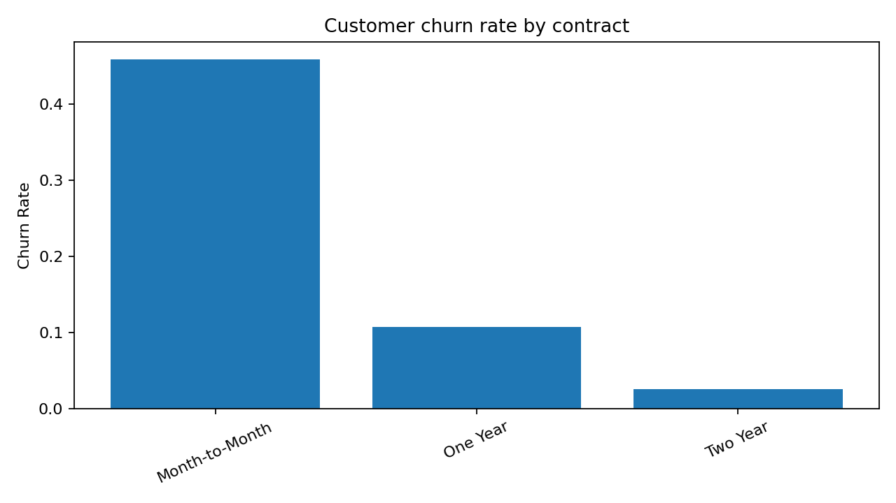

# Telecom Customer Churn Analytics

An end-to-end analytics project using **Python, MySQL and Power BI** to examine customer attrition, revenue, contracts, services and recorded churn drivers across 7,043 telecom customers.



## Verified portfolio metrics

The committed reports are generated directly from `data/raw/telco.csv`:

| Metric | Value |
|---|---:|
| Customers | 7,043 |
| Churned customers | 1,869 |
| Churn rate | 26.54% |
| Total revenue | $21,371,131.69 |
| Average monthly charge | $64.76 |
| Average tenure | 32.39 months |

Key descriptive findings from the dataset:

- Month-to-month contracts have a **45.84%** churn rate, compared with **10.71%** for one-year and **2.55%** for two-year contracts.
- Fibre-optic customers have the highest recorded churn rate among internet types at **40.72%**.
- The most frequently recorded churn category is **Competitor**, representing 841 of the 1,869 churned customers.

These are descriptive associations in this dataset, not causal conclusions.

## Business questions

1. What is the overall churn rate and revenue exposure?
2. Which contract types and services have the highest churn rates?
3. Which recorded reasons contribute most to churn?
4. How do payment method, tenure and satisfaction differ across customer outcomes?
5. Which segments should be prioritised for deeper retention analysis?

## Project structure

```text
.
├── assets/                         # Reproducible charts used in this README
├── data/
│   ├── raw/telco.csv               # Source dataset (7,043 rows, 50 columns)
│   └── processed/                  # Generated clean CSV for MySQL
├── notebooks/01_connect_mysql.py   # Secure connectivity/query example
├── powerBI/README.md               # Dashboard design and PBIX guidance
├── reports/                        # Verified JSON/CSV outputs
├── scripts/
│   ├── build_reports.py            # Rebuilds reports and charts
│   └── prepare_mysql_data.py       # Creates snake_case MySQL input
├── sql/                            # Schema, load script and analytics views
├── src/telecom_churn/              # Reusable Python analysis/database code
└── tests/
```

## Reproduce the analysis

```bash
python -m venv .venv
```

Windows:

```bash
.venv\Scripts\activate
```

macOS/Linux:

```bash
source .venv/bin/activate
```

Install dependencies and the package:

```bash
pip install -r requirements.txt
pip install -e .
```

Rebuild all reports and charts:

```bash
python scripts/build_reports.py
```

Run tests:

```bash
pip install -r requirements-dev.txt
pytest
```

## MySQL workflow

1. Copy `.env.example` to `.env` and enter a **local** MySQL username/password.
2. Generate the clean snake_case CSV:

```bash
python scripts/prepare_mysql_data.py
```

3. Run `sql/01_schema.sql`.
4. Update the absolute CSV path in `sql/02_load_data.sql`, then run it with `LOCAL INFILE` enabled.
5. Run `sql/03_analytics_views.sql`.
6. Test the connection:

```bash
python notebooks/01_connect_mysql.py
```

Credentials are read from environment variables and are not stored in source code.

## Power BI

The original repository already contains `powerBI/telecom_churn.pbix`. Preserve that binary file while applying this package. See `powerBI/README.md` for recommended pages and validation checks.

## Data quality notes

- `Churn Category` and `Churn Reason` are populated only for churned customers, so their missing values are structurally expected for other customer statuses.
- `Internet Type` is blank for customers without an applicable internet type.
- `Customer ID` is validated as unique before analysis.
- Reported rates are calculated as churned customers divided by all customers within the displayed segment.

## Security correction

The previous repository version included a plaintext MySQL password in `notebooks/01_connect_mysql.py`. This version removes the credential and uses `.env` variables. Any password previously committed should be changed because deleting it from the latest file does not remove it from Git history.

## Limitations

- The project is descriptive and does not claim that a segment attribute causes churn.
- No predictive model or out-of-sample evaluation is included.
- The dataset represents a fixed snapshot and may not generalise to another telecom provider or time period.

## Author

**Govardhan Reddy** — MSc Big Data Analytics candidate

## Licence

Code is released under MIT. Confirm the source dataset's licence and attribution requirements before redistributing it elsewhere.
